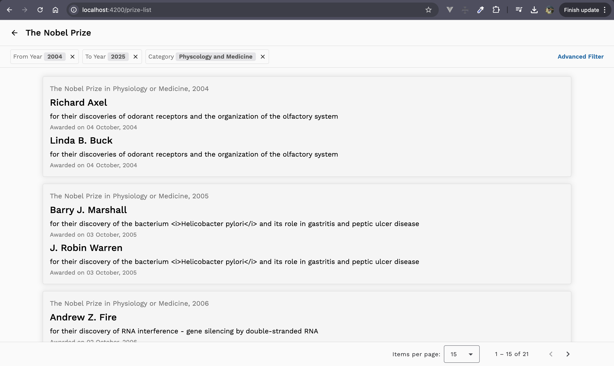
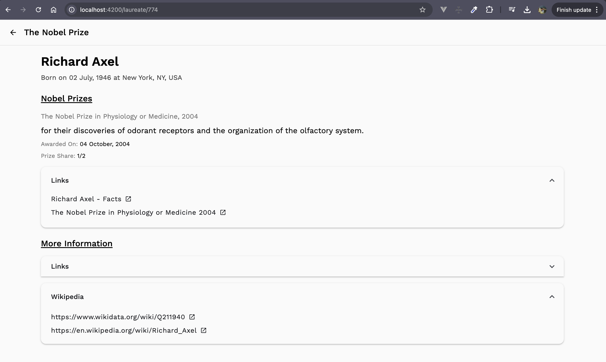

# Noble Prize Winners

This project displays a list of Nobel Prize winners. It fetches data from an API and presents it in a user-friendly format.

This project was generated using [Angular CLI](https://github.com/angular/angular-cli) version 19.2.4.

# Deployed URL

You can access the deployed application at https://nobel-winners-eba46.web.app 🚀

# Design Docs

You can find the design documents in the [attached-docs](https://github.com/vishwasprabhu98/nobel-prize-winner/tree/main/attached-docs) folder with the respective filenames.

- [Rough Design](https://github.com/vishwasprabhu98/nobel-prize-winner/blob/main/attached-docs/Rough-Design.pdf)

- [Application Document](https://github.com/vishwasprabhu98/nobel-prize-winner/blob/main/attached-docs/Nobel-Prize-Winners.pdf)

## Development server

To start a local development server, run:

```
ng serve
```

Once the server is running, open your browser and navigate to `http://localhost:4200/`. The application will automatically reload whenever you modify any of the source files.

## Handling CORS Issues

If you encounter a CORS error while making API requests, follow these steps:

Start the proxy server by running:

```
npm run server
```

This will run the server in `http://localhost:3000`

Update the API base URL in environment.ts to point to the local proxy server.


## Code scaffolding

Angular CLI includes powerful code scaffolding tools. To generate a new component, run:

```bash
ng generate component component-name
```

For a complete list of available schematics (such as `components`, `directives`, or `pipes`), run:

```bash
ng generate --help
```

## Building

To build the project run:

```bash
ng build
```

This will compile your project and store the build artifacts in the `dist/` directory. By default, the production build optimizes your application for performance and speed.

# Screenshots

#### Nobel Laureates List



#### Laureate Information



#### Dashboard

